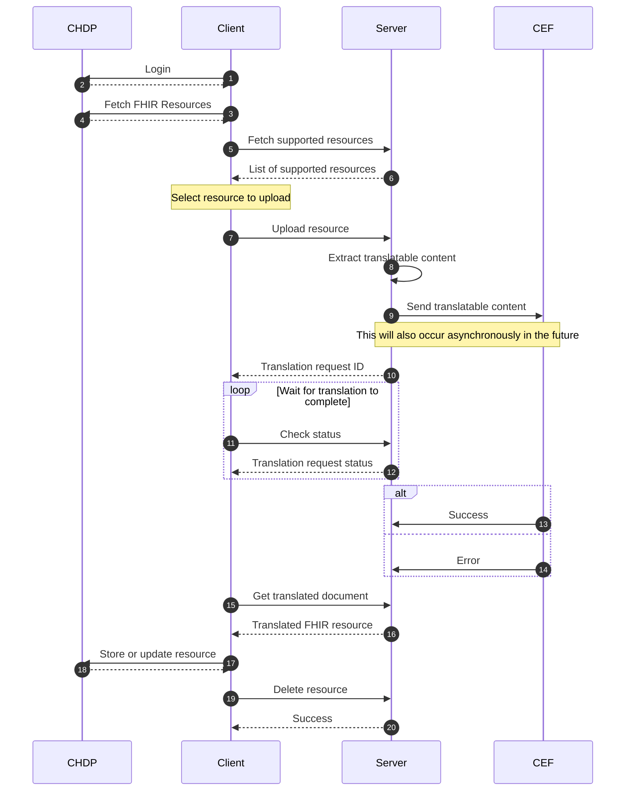

# etranslation-service

---

## Acknowledgements


This project has received funding from the European Union’s Horizon 2020 research and innovation programme under grant agreement No 826117.

---

Backend service for the eTranslation app to use, abstracting other translation services, currently
[CEF eTranslation].

[CEF eTranslation]: https://ec.europa.eu/cefdigital/wiki/display/CEFDIGITAL/How+to+submit+a+translation+request+via+the+CEF+eTranslation+webservice

## API

See [`openapi.yaml`](server/src/main/resources/openapi.yaml)

### Flow



## Build

```
$ ./gradlew jibDockerBuild
```

Requires docker, useful for local testing.

> Note: Other `jib` tasks may try to upload the built image to a registry
> immediately, this task will only "upload" to the local docker daemon

The Shadow plugin is also applied, enabling

```
$ ./gradlew shadowJar
```

which will output a jar with all dependencies in [libs](server/build/libs)

## Run

A postgres database is needed to run the server. Create one with docker:

```
$ docker run --rm -it --name postgres -e POSTGRES_USER=user -e POSTGRES_PASSWORD=pass -e POSTGRES_DB=etranslation -p 5432:5432 postgres
```

This will create a local postgres database configured with the default credentials
in [server.properties](server/src/main/resources/server.properties)

> Note: For development, try `./gradlew postgresRun` to start the DB
> in the background, and stop with `./gradlew postgresRm`

> Note: Inspect the database manually with `docker exec -it postgres psql -U user etranslation`

To run the server with docker:

> Note: The server requires a 32 byte key encoded as a hex string
> to start, passed in the `ES_DATABASE_KEY` environment variable.
>
> For ease of development, you can set it to `hardcoded` to use a hardcoded
> key.  Real keys can be generated with `openssl rand -hex 32`

```
$ docker run --rm -it -p 8080:8080 -e ES_DATABASE_KEY=hardcoded etranslation-service
```

For local development, `ES_DATABASE_KEY=hardcoded ./gradlew run` is quicker.

To run the Shadow jar:

```
$ ES_DATABASE_KEY=hardcoded java -jar server/build/libs/server-VERSION-all.jar
```
